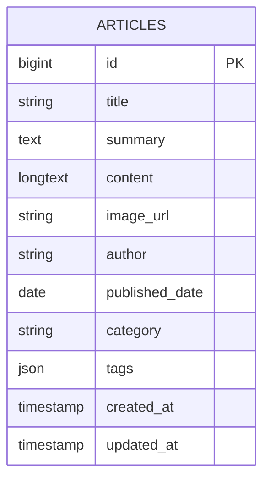

<div align="center">
  
</div>

<div align="center">


</div>

## Overview

**Website Informasi** adalah portal artikel keamanan siber berbasis Laravel yang dirancang untuk simulasi SOC Analyst dan mahasiswa keamanan informasi. Project ini menampilkan sistem manajemen konten (CMS) untuk artikel cybersecurity, integrasi AI untuk pembuatan draf artikel dan analisis log insiden, serta audit hardening checklist interaktif.

Cocok untuk tugas kuliah, portfolio, atau demo presentasi dengan data siap pakai.

## Key Features

- **Artikel Keamanan Siber** — CRUD lengkap dengan kategori: Incident Response, Threat Intelligence, System Hardening, Digital Forensics, Vulnerability Management.
- **Markdown Rendering** — Konten artikel ditulis dalam Markdown (tabel, code block, heading, list) dan dirender menjadi HTML dengan styling custom.
- **AI Article Draft Generator** — Asisten penulisan artikel otomatis via Google Gemini (`gemini-2.0-flash`) atau OpenRouter (multi-model fallback: GPT-OSS 120B, Nemotron, Gemma, Nex-N2).
- **AI Log Investigator** — Analisis log keamanan (SIEM, syslog, Apache, Windows Event) secara real-time menggunakan Gemini — menghasilkan klasifikasi ancaman, IoC, dan langkah mitigasi.
- **Audit Hardening Checklist** — Checklist interaktif kepatuhan hardening server (Windows & Linux) dengan skor progres, filter OS, dan badge severity (Critical/High/Medium).
- **Admin Panel** — Autentikasi session-based, dashboard CMS dengan pencarian, kelola artikel (create, read, update, delete), upload gambar, dan AI draft generator.
- **Pencarian & Filter** — Halaman depan mendukung pencarian teks penuh (judul, ringkasan, konten, penulis, tag) dan filter berdasarkan kategori.
- **Responsive UI** — Dark theme dengan desain cartoon brutalist, dibangun di atas Tailwind CSS + Alpine.js.

## Database Schema

Project ini memakai tabel `articles` sebagai inti penyimpanan konten.

### `articles`

| Column          | Type      | Description                                         |
| --------------- | --------- | --------------------------------------------------- |
| `id`           | bigint    | Primary key                                         |
| `title`        | string    | Judul artikel                                       |
| `summary`      | text      | Ringkasan singkat artikel                           |
| `content`      | longtext  | Isi artikel dalam format Markdown                   |
| `image_url`    | string    | URL gambar utama artikel (nullable)                 |
| `author`       | string    | Nama penulis (default: "SOC Team Contributor")      |
| `published_date` | date    | Tanggal publikasi artikel                           |
| `category`     | string    | Kategori: Incident Response, Threat Intelligence, System Hardening, Digital Forensics, Vulnerability Management |
| `tags`         | json      | Array tag artikel (contoh: `["incident-response", "windows"]`) |
| `created_at`   | timestamp | Waktu data dibuat                                   |
| `updated_at`   | timestamp | Waktu data terakhir diubah                          |

## Entity Relationship Diagram



## API Endpoints

| Method | Endpoint                  | Description                                       |
| ------ | ------------------------- | ------------------------------------------------- |
| POST   | `/gemini/analyze-log`    | Analisis log keamanan via Gemini AI               |
| POST   | `/admin/gemini/generate-draft` | Generate draf artikel via Gemini / OpenRouter |

> **Catatan:** API endpoints bersifat internal (tidak exposed sebagai public REST API) — digunakan oleh frontend via AJAX. Tidak ada otentikasi API key untuk endpoint log analyzer, sedangkan draft generator memerlukan session admin.

## Sample AI Responses

### Log Analysis Response

```json
{
  "analysis": "Log menunjukkan serangan SQL Injection terstruktur dari IP 192.168.1.45...",
  "threatLevel": "Critical",
  "classification": "SQL Injection (Union-based)",
  "indicators": [
    "IP Sumber: 192.168.1.45",
    "User-Agent: Kali-Linux / sqlmap 1.6.4",
    "Payload UNION SELECT pada parameter 'category'"
  ],
  "remediationSteps": [
    "Blokir IP 192.168.1.45 di firewall perimeter",
    "Implementasi prepared statements pada seluruh query database",
    "Aktifkan WAF (Web Application Firewall) dengan ruleset OWASP",
    "Lakukan audit menyeluruh pada endpoint /api/v1/products.php"
  ]
}
```

### Article Draft Response

```json
{
  "title": "Analisis Forensik Digital: Melacak Jejak Persistensi Malware Ransomware Melalui Registry Windows",
  "summary": "Eksplorasi forensik digital pada artifak Windows Registry untuk merekonstruksi jejak persistensi malware...",
  "content": "### Pendahuluan\nKetika insiden infeksi ransomware melanda...",
  "category": "Digital Forensics",
  "tags": ["digital-forensics", "malware-analysis", "windows-registry"],
  "imageUrl": "https://images.unsplash.com/photo-1601597111158-2fceff270190?auto=format&fit=crop&w=1200&q=80",
  "imageQuery": "digital forensics cybersecurity dark investigative"
}
```

## Quick Start

```bash
# 1. Clone & install dependencies
git clone <repo-url>
cd <project-folder>
composer install

# 2. Setup environment
cp .env.example .env
# Edit .env: DB_HOST, DB_DATABASE, DB_USERNAME, DB_PASSWORD
# (Optional) Tambahkan GEMINI_API_KEY, OPENROUTER_API_KEY

# 3. Generate application key
php artisan key:generate

# 4. Migrate & seed database
php artisan migrate:fresh --seed

# 5. Jalankan development server
php artisan serve
```

Buka browser:
- **Halaman utama:** `http://127.0.0.1:8000`
- **Login admin:** `http://127.0.0.1:8000/login`
- **Kredensial default:** `admin` / `blueteam2026`

## Project Structure

```text
app/
  Http/Controllers/
    ArticleController.php       # Index & detail artikel dengan pencarian & filter
    AdminController.php         # CMS CRUD artikel + upload gambar
    AuthController.php          # Login/logout admin (session-based)
    GeminiController.php        # Integrasi Gemini + OpenRouter untuk AI
  Models/
    Article.php                 # Model artikel dengan $fillable & $casts
  Support/
    MarkdownRenderer.php        # Custom Markdown → HTML parser (tabel, code block, heading, list)
  Middleware/
    AdminSession.php            # Middleware penjaga session admin
bootstrap/
  app.php
config/
  app.php                       # Konfigurasi aplikasi (timezone: Asia/Makassar, locale: id)
  services.php                  # Konfigurasi Gemini & OpenRouter
database/
  migrations/
    2026_06_08_000001_create_articles_table.php
  seeders/
    DatabaseSeeder.php          # 3 artikel seed siap demo
routes/
  web.php                       # Semua routing (home, articles, admin, auth, gemini)
resources/
  views/
    home.blade.php              # Halaman utama (grid artikel + filter)
    home_ai.blade.php           # Panel Log Investigator AI
    home_checklist.blade.php    # Panel Audit Hardening Checklist
    admin/
      index.blade.php           # Dashboard CMS (tabel CRUD)
      form.blade.php            # Form create/edit artikel + AI draft generator
    articles/
      show.blade.php            # Halaman detail artikel
      _detail.blade.php         # Partial render konten artikel
    auth/
      login.blade.php           # Halaman login admin
    layouts/
      app.blade.php             # Layout utama (header, footer, Tailwind CDN, Alpine.js CDN)
public/
  uploads/                      # Folder upload gambar artikel
```

## Seed Data

Seeder menyediakan **3 artikel demo** bertema keamanan siber:

1. **Mendeteksi Lateral Movement** — Event ID 4624, Logon Type, PsExec detection (Incident Response)
2. **Linux Server Hardening** — SSH hardening, Fail2ban, UFW/IPTables (System Hardening)
3. **Analisis Forensik Digital** — Windows Registry persistence, ransomware (Digital Forensics)

Jalankan `php artisan db:seed` kapan saja untuk mengisi ulang data demo.

## Tech Stack

- **Backend:** Laravel 10.x, PHP 8.1+
- **Database:** MySQL (production via InfinityFree) / SQLite (local fallback)
- **AI:** Google Gemini 2.0 Flash + OpenRouter (GPT-OSS 120B, Nemotron 3-Super, Gemma 4, Nex-N2)
- **Frontend:** Tailwind CSS (CDN), Alpine.js 3.x (CDN)
- **HTTP Client:** Guzzle 7.x (untuk koneksi ke Gemini & OpenRouter API)
- **Icons/Fonts:** Google Fonts (Plus Jakarta Sans, Newsreader, JetBrains Mono)

## Academic Mapping (PBW)

- **Definisi Web App:** Portal informasi berbasis Laravel dengan CMS, integrasi AI, dan UI interaktif.
- **Tujuan/Pemanfaatan:** Sarana edukasi dan publikasi artikel keamanan siber; tools bantu analisis log untuk SOC Analyst.
- **Pentingnya Web:** Mendukung penyebaran informasi keamanan, otomatisasi penulisan konten via AI, dan analisis ancaman real-time.
- **Program sederhana + database:** Terealisasi via CRUD artikel dengan pencarian full-text, filter kategori, dan penyimpanan JSON tags.

## Author

**Mocha Rezky**

---
